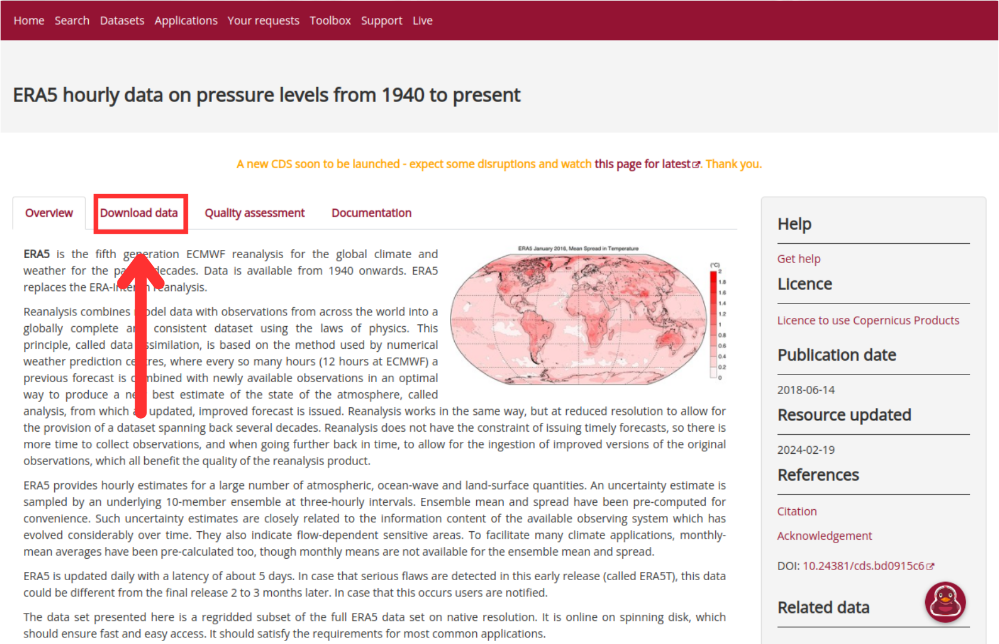
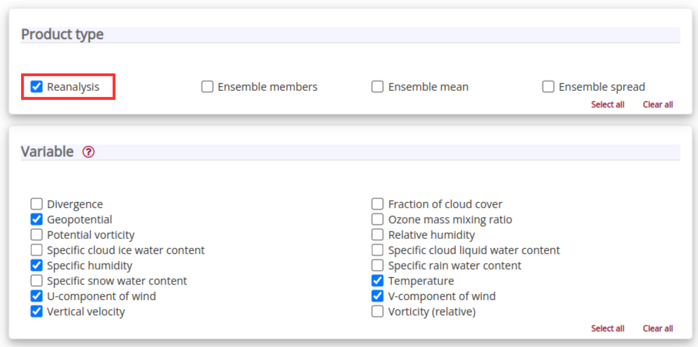
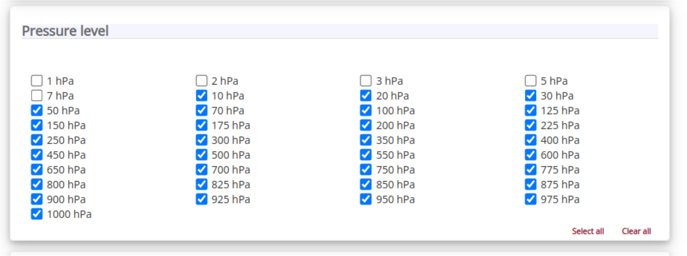
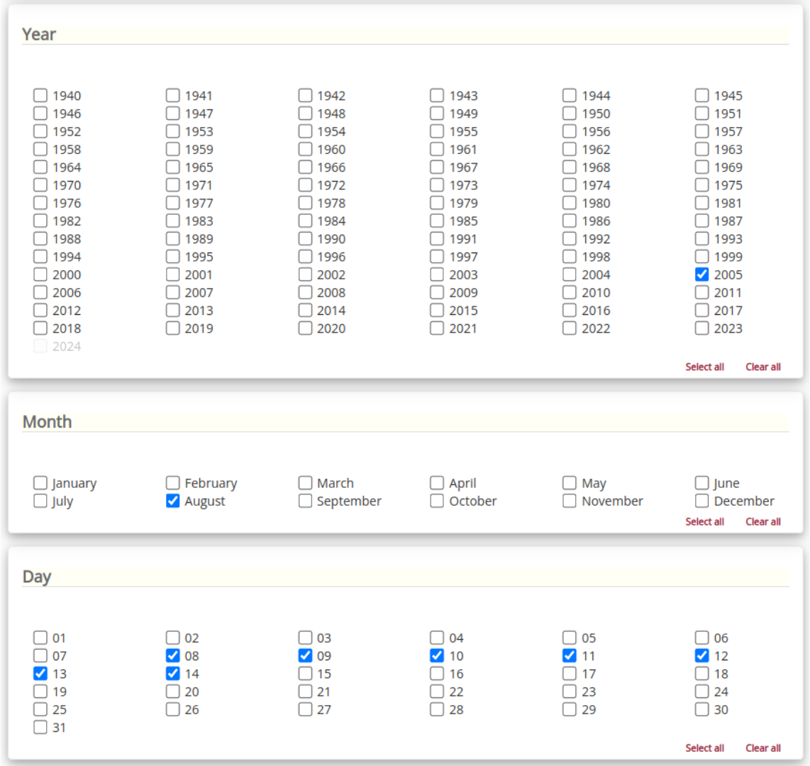
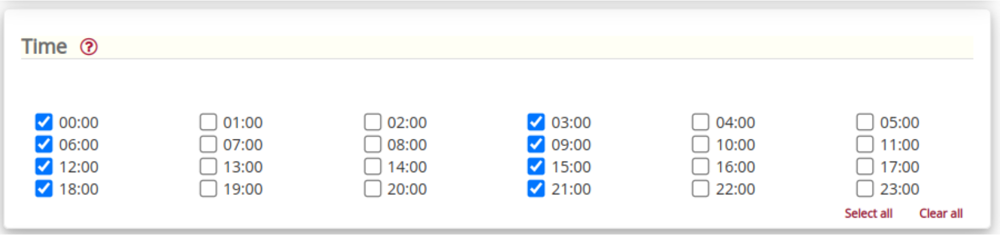
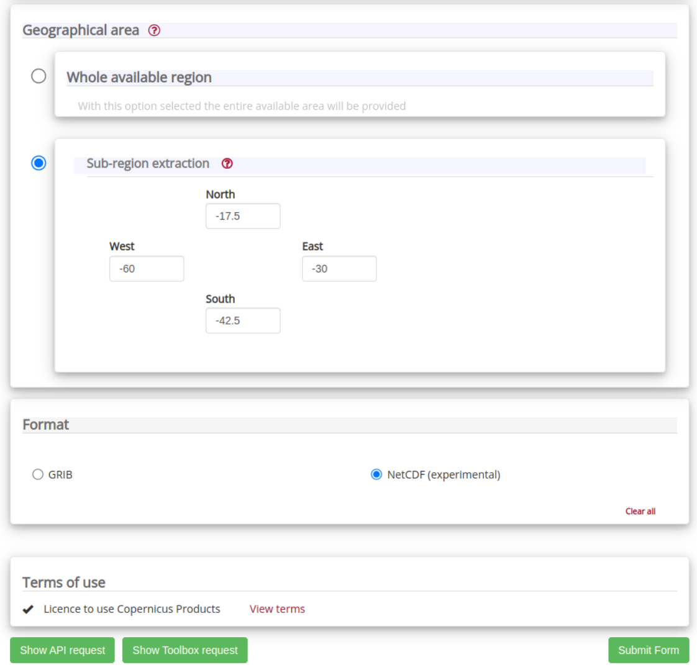

Downloading Data
================

ATMOS-BUD requires a single NetCDF file containing the necessary meteorological data as input. The data should include geopotential, temperature, specific humidity, vertical velocity, and the u and v components of the wind. It is essential that the data be organized in a structured grid format and that the vertical coordinate be on isobaric (pressure) levels.

In the following example, we will guide you through the process of downloading data for the ECMWF's ERA5 dataset, focusing on an atmospheric system that occurred in the Southern Atlantic region near Southeast Brazil in 2005.

Method 1: Copernicus Interface
-------------------------------

1. Access the Copernicus Climate Data Store (CDS) website at `https://cds.climate.copernicus.eu/#!/home`_. Create an account or log into your existing account.

2. Visit the ERA5 dataset page at `https://cds.climate.copernicus.eu/cdsapp#!/dataset/reanalysis-era5-pressure-levels?tab=overview`_ and click on "Download Data".

3. Select the necessary variables for your analysis.

4. Select the desired vertical levels for your analysis. For this example, we are using data from the surface to 10 hPa.

5. Choose the time range of interest. Make sure to select the dates that correspond to the atmospheric event you wish to analyze.

6. Define the temporal resolution. In this case, we will opt for 3-hourly data for simplicity.

7. Specify the spatial extent by selecting the geographic region that covers the atmospheric system you are studying.

8. Choose the output file format. Select 'NetCDF' as the preferred format for the output data.

9. After all selections have been made, submit the data retrieval request. You will receive the dataset in the specified format once the request has been processed.

10. Once you have downloaded the dataset, it is advisable to rename the file for easier identification and organization. Use a convention that includes the system identifier and dataset name, such as ``system-identifier_dataset-name.nc``. For example, rename your downloaded file to ``system-20050808_ERA5.nc`` to reflect the system date and data source.

Method 2: Automated Download Using `get_era5_data.py`
------------------------------------------------------

For those who prefer an automated approach to downloading ERA5 data, ATMOS-BUD includes a Python script that utilizes the ECMWF's `cdsapi` library. This method streamlines the data retrieval process, allowing you to specify your data requirements directly within the script.

1. Navigate to the `src` directory where the `get_era5_data.py` script is located.

.. code-block:: bash

    cd src

2. Before running the script, it's recommended to create a copy and edit the copy instead. This ensures that the original script remains unaltered for future reference.

.. code-block:: bash

    cp get_era5_data.py custom_get_era5_data.py

3. Open the `custom_get_era5_data.py` script in your preferred text editor. Inside the script, locate the section where input parameters are specified, such as pressure levels, dates, and spatial coverage. Modify these inputs to match your specific data requirements.

4. Once you have configured the script with your desired parameters, save the changes, and run the script from the terminal:

.. code-block:: bash

    python custom_get_era5_data.py

The script will automatically communicate with the Copernicus Climate Data Store, request the specified data, and download it in NetCDF format to your local machine. This method is particularly useful for automating the data retrieval process and can be easily integrated into larger data processing workflows.

.. note::
   Ensure you have the `cdsapi` library installed and configured with your CDS API key before running the script. For more information on setting up `cdsapi`, visit the official `cdsapi` installation guide and user documentation: `https://cds.climate.copernicus.eu/api-how-to`

.. note::
    The script `get_era5_data.py` includes the option to specify the output file name directly within the script. It is advisable to choose a name that facilitates easy identification and organization of your datasets. We recommend adopting a naming convention that incorporates the system identifier and the dataset name. For example, naming your output file as ``system-20050808_ERA5.nc`` can be beneficial, where ``20050808`` denotes the date of the atmospheric event under analysis, and ``ERA5`` represents the dataset source. This practice ensures your files are organized systematically, enhancing the efficiency of data management and retrieval for future analyses.
