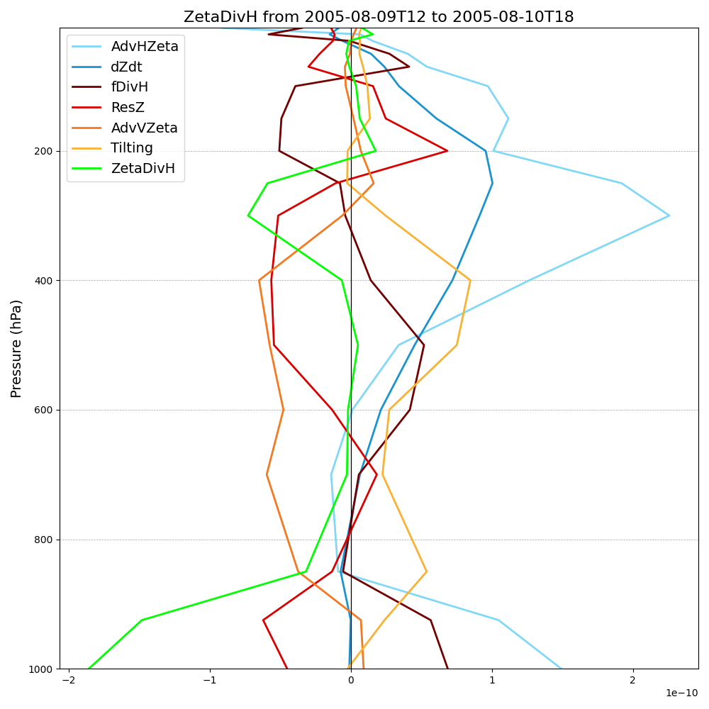

Fixed Framework Tutorial
########################

This section provides a comprehensive guide to using the **Fixed Framework** of ATMOS-BUD. The Fixed framework allows users to analyze the atmospheric budgets within a predefined, stationary domain. This is particularly useful for analyzing systems that do not move significantly, such as convergence zones and other localized phenomena, or even cyclones that have relatively small displacements, such as the example case used here.

In this tutorial, we will use data from the **Reg1 cyclone**, which originated in the southeastern Brazil and was documented in the article *Dias Pinto, J. R., and R. P. da Rocha (2011), The energy cycle and structural evolution of cyclones over southeastern South America in three case studies, J. Geophys. Res., 116, D14112*. The data for Reg1 comes from the NCEP reanalysis and covers the period from August 8 to August 14, 2005.

Preparing Your Environment
*****************************

Before running the program, ensure that your environment is set up correctly. This includes activating the conda environment and preparing the input files.

1. Activate the Conda Environment:
----------------------------------

Ensure that your conda environment is activated before running the program. This will make sure that all required dependencies are available.

Run the following command to activate the environment:

.. code-block:: bash

   conda activate atmosbud

2. Prepare Input Files:
-----------------------

You need to ensure that the ``box_limits`` file and the ``namelist`` file are correctly configured in the ``inputs/`` directory. These files define the domain limits for analysis and the settings for the NCEP reanalysis data.

- **Copy the appropriate** ``box_limits`` **file:**
   The ``box_limits`` file specifies the region of interest for the cyclone. In this tutorial, we will use the ``box_limits_Reg1`` file for the Reg1 cyclone.

.. code-block:: bash

   cp inputs/box_limits_Reg1 inputs/box_limits

- **Copy the** ``namelist`` **file for NCEP-R2:**
   The ``namelist`` file contains the configuration for running the program with the NCEP reanalysis data. Ensure you use the correct namelist configuration for your data.

.. code-block:: bash

   cp inputs/namelist_NCEP-R2 inputs/namelist

Once these steps are completed, you are ready to run the program with the Fixed Framework.

Running ATMOS-BUD with the Fixed Framework
*********************************************

Main Execution
--------------

To run ATMOS-BUD using the **Fixed Framework**, use the following command in your terminal:

.. code-block:: bash

   python atmos_bud.py path-to-file/your_input_file.nc -f

Where: 
   * ``path-to-file/your_input_file.nc``: This is the path to your input NetCDF file containing atmospheric data.
   * ``-f``: This flag tells ATMOS-BUD to use the **Fixed Framework** for the analysis.

For example, to analyze the cyclone data for Reg1 (as mentioned earlier), you would run the following command:

.. code-block:: bash

   python atmos_bud.py samples/Reg1-Representative_NCEP-R2.nc -f

Ensure that the ``namelist`` and ``box_limits`` files are correctly set up in the ``inputs/`` directory before running the command. This setup allows ATMOS-BUD to compute the atmospheric budgets over the defined domain with the results stored in the ``Results/`` directory and visualizations generated for further analysis.

Example Terminal Output
-----------------------

When you run the program, you will see detailed logs in the terminal. Below is an example output for the execution of the program, explaining the key components of the process:

.. code-block:: bash

   2025-06-12 14:38:28,610 - atmos_bud - INFO - Loading samples/Reg1-Representative_NCEP-R2.nc...
   2025-06-12 14:38:28,944 - atmos_bud - INFO - Loaded samples/Reg1-Representative_NCEP-R2.nc successfully!
   2025-06-12 14:38:28,945 - atmos_bud - INFO - Preprocessing data...
   2025-06-12 14:38:28,953 - atmos_bud - INFO - Done.
   2025-06-12 14:38:28,953 - atmos_bud - INFO - Computing zeta and temperature tendencies...
   2025-06-12 14:38:28,997 - atmos_bud - INFO - Done.
   2025-06-12 14:38:28,997 - atmos_bud - INFO - Directory where results will be stored: ./Results/Reg1-Representative_NCEP-R2_fixed
   2025-06-12 14:38:28,997 - atmos_bud - INFO - Directory where figures will be stored: ./Results/Reg1-Representative_NCEP-R2_fixed/Figures
   2025-06-12 14:38:28,997 - atmos_bud - INFO - Name of the output file with results: Reg1-Representative_NCEP-R2_fixed
   2025-06-12 14:38:29,008 - atmos_bud - INFO - Processing time step: 2005-08-08 00Z
   2025-06-12 14:38:29,193 - atmos_bud - INFO - Storing results for: 2005-08-08 00Z
   2025-06-12 14:38:29,193 - atmos_bud - INFO - 850 hPa diagnostics --> min ζ: -3.30e-05, min geopotential height: 1409, max wind speed: 15.92
   2025-06-12 14:38:29,193 - atmos_bud - INFO - 850 hPa positions (lat/lon) --> min ζ: -25.00, -57.50, min geopotential height: -42.50, -30.00, max wind speed: -42.50, -45.00
   ...

Explanation of Key Terminal Outputs
-----------------------------------

**Loading and Preprocessing**:  
   The program first loads the input data (``samples/Reg1-Representative_NCEP-R2.nc``), preprocesses it, and then begins the main computation (e.g., computing vorticity and temperature tendencies).
  
.. code-block:: bash

   2025-06-12 14:38:28,610 - atmos_bud - INFO - Loading samples/Reg1-Representative_NCEP-R2.nc...
   2025-06-12 14:38:28,945 - atmos_bud - INFO - Preprocessing data...

**Time Step Processing**:  
   For each time step, the program calculates atmospheric diagnostics like central minimum/maximum vorticity (`ζ`) and geopotential height, and maixmum wind speed within the domain. The results for each time step are stored, and figures are created.

.. code-block:: bash

   2025-06-12 14:38:29,008 - atmos_bud - INFO - Processing time step: 2005-08-08 00Z
   2025-06-12 14:57:32,776 - atmos_bud - INFO - Storing results for: 2005-08-08 00Z
   2025-06-12 14:57:32,776 - atmos_bud - INFO - 850 hPa diagnostics --> min ζ: -3.30e-05, min geopotential height: 1409, max wind speed: 15.92
   2025-06-12 14:57:32,776 - atmos_bud - INFO - 850 hPa positions (lat/lon) --> min ζ: -25.00, -57.50, min geopotential height: -42.50, -30.00, max wind speed: -42.50, -45.00

**Results and Figures**:  
   The program saves figures showing the defined domain box for computations are also saved in the ``Figures/`` directory.

.. code-block:: bash

   2025-06-12 14:38:29,958 - atmos_bud - INFO - Created figure with box defined for computations at box_200508080000.png

**Completion Message**:  
   Once the analysis is complete, the program will display the total time taken for the execution.

.. code-block:: bash

   2025-06-12 14:38:49,711 - atmos_bud - INFO - --- 21.106063842773438 seconds for running the program ---

By interpreting this output, users can confirm the successful loading of data, the processing of each time step, and the generation of output files for further analysis.

Understanding the Output Files
*********************************

After running the program, several files and plots are generated. Below is an example of the output directory structure and some of the generated visualizations.

Figures Directory:
---------------------

The ``Figures/`` folder contains plots that visualize the defined analysis box and the atmospheric conditions within that box for each time step. 

Example of a figure showing the domain at 850 hPa for August 8, 2005:
  
  .. image:: _static/images/box_200508080000.png
     :alt: Box defined for computations
     :width: 500px
     :align: center

This plot shows the domain used for the analysis of the cyclone, with the following elements:
   * **Geopotential height** (shaded) and **vorticity contours** at 850 hPa.
   * **Maximum wind speed** (triangle), **minimum vorticity** (black circle) and **minimum geopotential height** (black cross) within the domain.

The domain can be modified using the ``-l LEVEL``, ``--track-vorticity``, and ``--track_geopotential`` flags:
  
   * ``-l LEVEL``: Allows users to choose the pressure level for the analysis (default is 850 hPa).
   * ``--track-vorticity {min,max}``: Tracks the minimum or maximum vorticity (default is minimum).
   * ``--track_geopotential {min,max}``: Tracks the minimum or maximum geopotential height (default is minimum).

CSV Files:
-------------

In addition to the plots, ATMOS-BUD generates CSV files containing the diagnostic results. These files are organized in subdirectories by budget category: heat, moisture, and vorticity.

Each CSV file contains the following terms:

* **Heat Budget** (`heat_terms/`):
   * ``dTdt``: Temperature tendency (K/s).
   * ``Theta``: Potential temperature (K).
   * ``AdvHTemp``: Horizontal advection of temperature (K/s).
   * ``AdvVTemp``: Vertical advection of temperature (K/s).
   * ``Sigma``: Static stability term (K/Pa).
   * ``ResT``: Residual of the thermodynamic equation (K/s).
   * ``AdiabaticHeating``: Estimated diabatic heating (W/kg).

* **Vorticity Budget** (`vorticity_terms/`):
   * ``Zeta``: Relative vorticity (1/s).
   * ``dZdt``: Vorticity tendency (1/s).
   * ``AdvHZeta``: Horizontal advection of vorticity (1/s²).
   * ``AdvVZeta``: Vertical advection of vorticity (1/s²).
   * ``Beta``: Meridional gradient of the Coriolis parameter (1/m/s).
   * ``vxBeta``: Meridional advection of planetary vorticity (1/s²).
   * ``DivH``: Horizontal divergence of the wind (1/s).
   * ``ZetaDivH``: Term ζ·div(V) (1/s²).
   * ``fDivH``: Term f·div(V) (1/s²).
   * ``Tilting``: Tilting term (1/s²).
   * ``ResZ``: Residual of the vorticity budget (1/s²).

* **Moisture Budget** (`moisture_terms/`):
   * ``dQdt``: Specific humidity tendency (kg/m²/s).
   * ``dQdt_integrated``: Vertically integrated ``dQdt`` (kg/m²/s).
   * ``divQ``: Horizontal divergence of moisture flux (1/s).
   * ``divQ_integrated``: Vertically integrated ``div(Q)`` (kg/m²/s).
   * ``WaterBudgetResidual``: ``dQdt_integrated`` + ``divQ_integrated`` (kg/m²/s).

These CSV files allow for further analysis and visualization of the atmospheric budgets for the cyclone or system of interest.

Visualizing Generated Data
*****************************

Once ATMOS-BUD has successfully processed your data using the Fixed Framework, you can visualize the output variables using the provided example scripts. These scripts enable you to easily create maps and graphical representations from the resulting NetCDF files.

Visualizing Vertical Profiles
-----------------------------

To generate vertical profile plots for budget terms, follow these steps:

1. **Locate the vertical profiles script**:

The script `vertical-profiles_example.py` is located in the `plots` directory.

2. **Adjust inputs in the script**:

Modify the variables within the script to reflect the desired date range and budget category:

.. code-block:: python

      start_date = '2005-08-09T12'
      end_date = '2005-08-10T18'
      budget = 'vorticity'  # Options: 'heat', 'vorticity', or 'moisture'

3. **Run the vertical profile visualization script**:

Execute the script with Python:

.. code-block:: bash

      python plots/vertical-profiles_example.py

**Example Output:**

The following image shows a vertical profile example for the vorticity budget terms averaged between August 9, 2005, 12 UTC, and August 10, 2005, 18 UTC:

This vertical profile plot clearly presents variations of multiple budget terms with respect to atmospheric pressure, aiding in detailed atmospheric analysis.

Visualizing Hovmoller Diagrams
------------------------------

Hovmoller diagrams are useful for visualizing how a particular variable evolves over both time and space, typically along a given latitude or longitude. To generate a Hovmoller diagram for the **area mean** of a specific budget term, follow these steps:

1. **Locate the Hovmoller script:**

The script ``hovmoller_example.py`` is located in the figures/ directory.

2. **Adjust inputs in the script:**

Open the script ``hovmoller_example.py`` in a text editor. Modify the following variables to match your specific budget and variable:

.. code-block:: python

  budget = 'heat'               # Options: 'heat', 'vorticity', 'moisture'
  variable = 'AdvHTemp'         # Select the variable to visualize
  file = f'./Results/Reg1-Representative_NCEP-R2_fixed/{budget}_terms/{variable}.csv'

The budget variable can be one of the following: 'heat', 'vorticity', or 'moisture'. The variable should be the specific budget term (e.g., `AdvHTemp`, `dTdt`, etc.).

3. **Run the Hovmoller diagram script:**

Execute the script with Python:

.. code-block:: bash

  python figures/hovmoller_example.py

**Example Output:**

The following image shows an example of a Hovmoller diagram for the AdvHTemp (Horizontal Advection of Temperature) budget term for the heat budget, averaged over the time range of interest:

This diagram visualizes how the AdvHTemp variable changes with time along the chosen pressure levels, helping to understand the temporal evolution of atmospheric processes.

Spatial visualization of Budget Terms
-------------------------------------

To visualize a specific variable from the NetCDF output file, follow these steps:

1. **Locate the visualization script**:

The visualization script ``map_example.py`` is available in the ``figures/`` directory of your ATMOS-BUD project.

2. **Adjust inputs in the script**:

Open the script ``map_example.py`` in a text editor. Modify the following variables to match your specific data:

.. code-block:: python

      date = '2005-08-12T12'     # Choose the date and time of interest
      level = 1000               # Choose the vertical level (in hPa)
      nc_file = './Results/Reg1-Representative_NCEP-R2_fixed/Reg1-Representative_NCEP-R2_fixed.nc'

These parameters should match your data of interest (e.g., analysis date and vertical pressure level).

3. **Run the visualization script**:

Execute the script using Python:

.. code-block:: bash

      python figures/map_example.py

This will generate a map visualizing the chosen variable (``dTdt`` in this example), which represents the temperature tendency at the specified time and vertical level.

**Example Output:**

The following image is an example output generated by this script, showing the temperature tendency at 1000 hPa for August 12, 2005, at 12 UTC:

.. image:: _static/images/Reg1-Representative_NCEP-R2_fixed_dTdt_2005-08-12T12_1000hPa.png
   :alt: Temperature tendency visualization
   :width: 500px
   :align: center

This visualization clearly highlights regions with positive and negative temperature tendencies, allowing you to quickly interpret the atmospheric dynamics occurring within your defined domain.
