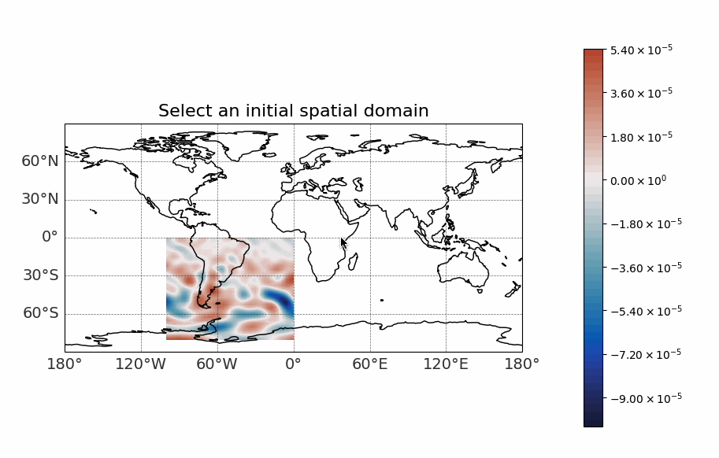
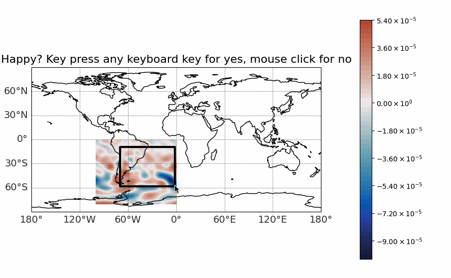
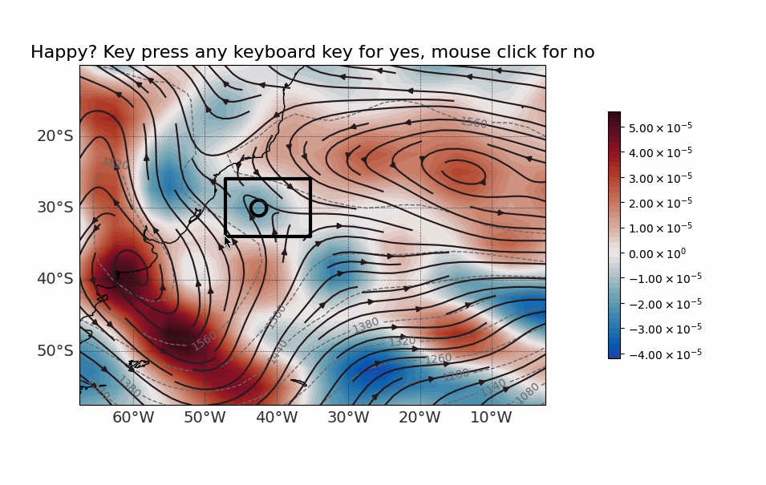

Interactive Framework Tutorial
###############################

This section provides a comprehensive guide to using the **Interactive Framework** of ATMOS-BUD. The Interactive framework allows users to dynamically define the analysis domain at each time step through a graphical interface. This flexible approach can be considered either semi-Lagrangian, if the domain varies across time steps, or Eulerian, if the user selects the same domain for all time steps (although using the Fixed Framework would be simpler in that scenario).

In this tutorial, we will use data from the **Reg1 cyclone**, documented in the article *Dias Pinto, J. R., and R. P. da Rocha (2011), The energy cycle and structural evolution of cyclones over southeastern South America in three case studies, J. Geophys. Res., 116, D14112*. The data for Reg1 comes from the NCEP reanalysis and covers the period from August 8 to August 14, 2005.

Preparing Your Environment
**************************

Before running the program, ensure that your environment is set up correctly. This includes activating the conda environment and preparing the ``namelist`` input file.

1. **Activate the Conda Environment:**
--------------------------------------

Activate your conda environment to ensure all dependencies are available:

.. code-block:: bash

   conda activate atmosbud

2. **Prepare Input File:**
--------------------------

The ``namelist`` file must be correctly configured in the ``inputs/`` directory. This file defines the settings for the NCEP reanalysis data.

- **Namelist file for NCEP-R2**:  
    Ensure you use the correct namelist configuration for your data.

.. code-block:: bash

   cp inputs/namelist_NCEP-R2 inputs/namelist

Once these steps are completed, you are ready to run the program with the **Interactive Framework**.

Running ATMOS-BUD with the Interactive Framework
************************************************

To run ATMOS-BUD using the **Interactive Framework**, use the following command in your terminal:

.. code-block:: bash

   python atmos_bud.py path-to-file/your_input_file.nc -c

Replace ``path-to-file/your_input_file.nc`` with the path to your NetCDF input file. For example, analyzing the Reg1 cyclone data:

.. code-block:: bash

   python atmos_bud.py samples/Reg1-Representative_NCEP-R2.nc -c

Ensure that the ``namelist`` file is properly configured in the ``inputs/`` directory.

Selecting the Domain Interactively
----------------------------------

Upon running the command, ATMOS-BUD will present graphical interfaces for domain selection:

1. **Initial Spatial Domain Selection:**  
    The first graphical window enables users to subset the initial spatial domain. This step is especially useful when dealing with global datasets or large regions to optimize computational resources.

2. **Choosing the Spatial Domain:**  
    After the initial selection, ATMOS-BUD displays a graphical window prompting users to define the analysis domain. Select two opposite vertices of the desired analysis box by clicking with the left mouse button.

3. **Domain Selection for Each Time Step:**  
    For each time step, ATMOS-BUD will display detailed maps of the atmospheric conditions (vorticity, geopotential height, wind streamlines) at the selected pressure level, allowing users to dynamically adjust the analysis box accordingly.

Confirm your selection by pressing any keyboard key, or adjust it by clicking again.

Terminal Outputs and Generated Files
------------------------------------

In the terminal background, ATMOS-BUD will display outputs similar to the Track Framework, indicating the progress of the analysis and diagnostic calculations for each time step.

The outputs will be generated in a directory named ``Reg1-Representative_NCEP-R2_choose``, structured similarly to the Track Framework. The main differences are:

- No predefined ``track`` input file is used, hence no identical ``track`` file will appear.
- A generated track file named ``Reg1-Representative_NCEP-R2_choose_track.csv`` will be created. This track is constructed from the domain selections made by the user and uses either minimum or maximum vorticity (depending on the flag ``--track-vorticity``) for tracking the cyclone.

All other outputs, such as figures and CSV files, are identical to those generated by the Track Framework. This includes domain boxes, diagnostic plots, and NetCDF files containing computed variables for the atmospheric budgets.

Visualizing Generated Data
**************************

The process of visualizing the output data from the **Interactive Framework** is exactly the same as in the **Fixed** and **Track Frameworks**. For detailed instructions on visualizing the generated variables, please refer to the **Visualizing Generated Data** section in the **Fixed Framework Tutorial**.

In summary:
   * Use the provided visualization scripts, such as ``map_example.py`` and ``vertical-profiles_example.py``, to generate maps and vertical profile plots from the resulting NetCDF files and CSV data.
   * These scripts can be found in the ``plots/`` directory.